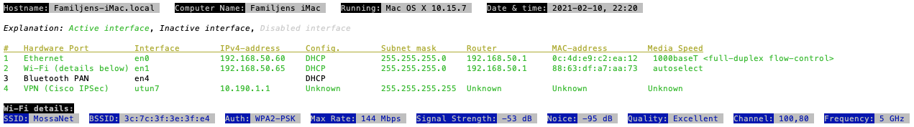

# network-info
A bash script for OS X that details information about the network

-----

Overview of how the script works:
---------------------------------

Data is gathered using the commands `ifconfig`, `networksetup`, `airport` and `scutil`. The network interfaces that the computer knows about is presented in the order they are used. `scutil` is used for VPN, but the solutions is not entirely satisfying (since VPN:s aren't easily placed in a priority chain). `airport` is used to get info on the wireless interface. With the `-w` option, only the wireless network information is presented.

Default interface is found with `netstat -rn`

One of the more useful parts of the script is the “Quality” assessment of the wireless network. This is calculated by subtract the noice level from the signal strength and then apply the following labels to the difference:

| Difference | Assessment |
|------------|------------|
| \>30:      | Excellent  |
| 20-30:     | Good       |
| 10-20:     | Poor       |
| <10:       | Unusable   |

These values are assigned by me through experience and they seems to be reasonable.
